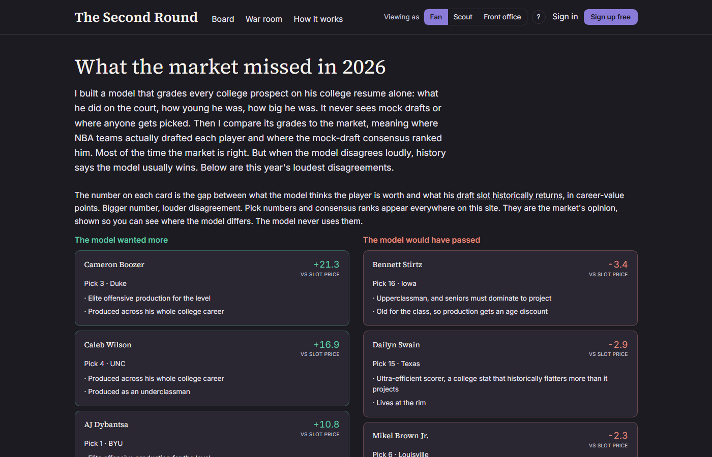
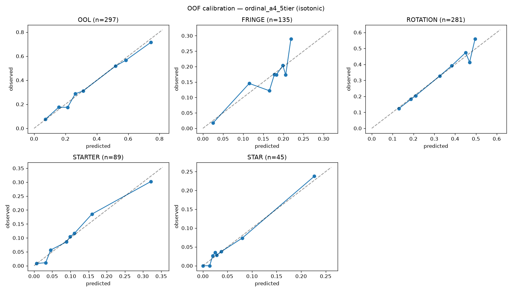
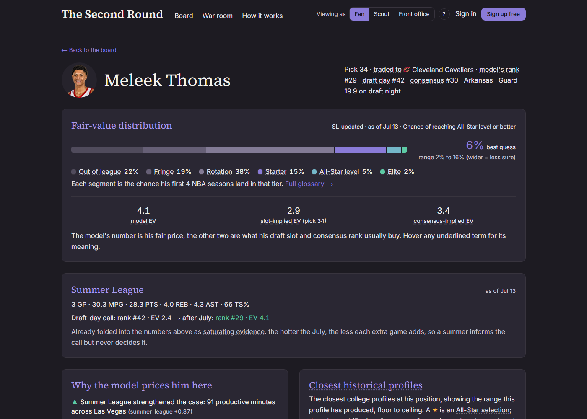

# The Second Round

**A quant-style NBA draft intelligence product. Live at [thesecondround.dev](https://thesecondround.dev).**

It prices every prospect with fair-value tier probabilities, compares those prices to the
market (draft slot + consensus boards), and says out loud who was overdrafted, who was
underdrafted, and why. It is also honest about the most important result in the backtest:
**the market beats the model on average.** The edge lives at the extremes of disagreement,
and above all in one place: picks 31-45. That is why it is called The Second Round.



## Why you can trust the numbers

Every claim below falls deterministically out of the scripts in this repo
(2009-2021 backtest, leave-one-draft-class-out cross-validation):

- **The market beats the model on average** (log loss 1.129 vs 1.266), stated up front,
  because pretending otherwise would poison everything downstream.
- **At the extremes of disagreement the model wins.** Its top-40 out-of-sample favorites
  realized **+5.3 utility above their draft-slot price** (permutation p < 0.0002); its
  top-40 fades realized -2.1 below (p < 0.0002).
- **The market is least efficient in picks 31-45**, the only region where the model's
  out-of-sample log loss beats the slot prior. Bane, Kyle Anderson, and Brunson country.
- A 25/75 model-market blend beats the market alone (1.124 vs 1.129): the box score still
  carries signal the league underweights.
- **The headline survives relabeling.** Refit from scratch under four independent outcome
  definitions, the market-beats-model result holds in all four and the top-40 edge stays
  significant in three. Full grid: [report/robustness.md](report/robustness.md).



Full write-up: [report/memo.md](report/memo.md) (front-office memo + technical appendix),
rendered in-app at `/methodology`. Every modeling decision and its rationale:
[DECISIONS.md](DECISIONS.md).

## What the product does

- **The board**: fair-value tier probabilities for every 2026 prospect, with bootstrap
  intervals, edge vs draft slot and consensus, and plain-English "why" bullets
- **Player pages**: full fair-value distribution, closest historical comps, and the
  frozen draft-night call shown beside any post-draft updates
- **Summer League layer** (July only): daily box scores become capped Bayesian evidence,
  weighted by how much summer ball has historically predicted, refreshed each morning
- **Scout notes**: free-text notes run through LLM extraction and capped Bayesian updates,
  producing your own EV, rank, and call beside the model's
- **War room**: simulates who is realistically still on the board at your pick,
  from 10,000 calibrated draft simulations
- **Free accounts** (Fan / Scout / Front-office roles) with a private scout book per user



## How the model works

1. **Define the outcome**: six career tiers over a player's first 4 NBA seasons
   (Out of League / Fringe / Rotation / Starter / All-Star / Elite)
2. **Convert the market to implied probability**: historical tier rates by draft slot,
   applied to actual slots and consensus ranks
3. **Build a base-rate prior**: age, size, class, production, competition level
4. **Add signal features**: research-backed college signals with empirical-Bayes shrinkage
5. **Model the full distribution**: calibrated tier probabilities with bootstrap intervals,
   never a single score
6. **Update with new evidence**: scout notes and Summer League box scores become capped
   likelihood ratios and a Bayesian posterior, with reliability weights measured on history
7. **Compare fair value to market**: EV edge + star-tail disagreement flags
8. **Backtest and calibrate**: leave-one-draft-class-out CV on the 2009-2021 classes

## Status

Live in production: model, board, scout-notes layer, war room, accounts, and the full
report. The 2026 draft was held June 23, 2026, so the board stands as the model's
on-the-record 2026 call. Through July 19 the board folds in a daily Summer League update;
the draft-day call itself stays frozen in the repo and the memo. Currently in a friends
testing round ahead of the 2027 live mode (roadmap in the memo).

## Using it

Go to [thesecondround.dev](https://thesecondround.dev). The product is free; an account
(also free) keeps your scout book, comps, and role across visits. The hosted product is
the product, but everything below is open: fork it and tune the labels, features, or
model however you like.

## Reproducing the research

The pipeline and model are fully reproducible from free public data (raw scraped tables
are not redistributed; the pipeline rebuilds them politely, rate-limited and disk-cached).
Python 3.11+:

```bash
python -m venv .venv
.venv/Scripts/pip install -r requirements.txt        # (Scripts -> bin on mac/linux)

# Data pipeline (one-time, ~15 min)
.venv/Scripts/python pipeline/pull.py                # all sources -> parquet
.venv/Scripts/python pipeline/resolve.py             # entity crosswalk (99.8%)
.venv/Scripts/python pipeline/labels.py              # outcome tiers + spot-check
.venv/Scripts/python pipeline/features.py            # feature matrix w/ EB shrinkage

# Model
.venv/Scripts/python model/prior.py                  # slot-implied market prior
.venv/Scripts/python model/train.py                  # LOCO-CV shootout + calibration
.venv/Scripts/python model/score.py                  # 2026 board + artifacts
.venv/Scripts/python model/simulate.py               # war-room availability sim
.venv/Scripts/python model/notes.py                  # Bayesian layer self-test
.venv/Scripts/python model/robustness.py             # relabeling robustness study

# Summer League evidence layer (July only)
.venv/Scripts/python pipeline/summer.py --history    # 2010-2025 SL box scores (one-time)
.venv/Scripts/python model/sl_calibrate.py           # reliability fit, leave-one-year-out
.venv/Scripts/python model/summer.py                 # daily 2026 pull + posterior
```

Every number in the memo falls out of those scripts deterministically.

## Repo layout

```
data/       raw cache (gitignored) + processed parquet
pipeline/   scrapers, cleaning, entity resolution, labeling, features
model/      training, calibration, bootstrap, slot base rates, bayes update, comps, robustness
api/        FastAPI: board, player, war room, posterior, notes, auth
web/        Next.js app
supabase/   Postgres schema + auth email templates
notebooks/  EDA, backtest, calibration plots
report/     methodology memo, robustness study, 2026 board
```

## Data sources (all free)

Barttorvik/T-Rank, Basketball-Reference, nba_api (combine), CBBpy/ESPN,
RSCI (via Sports-Reference), Rookie Scale + NBADraft.net consensus boards.
Player headshots are best-effort matched from ESPN's public API. Raw scraped
tables are **not** redistributed in this repo. The pipeline rebuilds them,
politely rate-limited and cached.

## Deployment

Production runs on Vercel (web) + Render (API) + Supabase (auth and scout books)
behind [thesecondround.dev](https://thesecondround.dev), all free tiers.
[DEPLOY.md](DEPLOY.md) records how it was stood up; [GO-LIVE.md](GO-LIVE.md) records
the domain, DNS, and email (Resend SMTP) setup.

## License

MIT. Built by Sahil Parikh, [LinkedIn](https://www.linkedin.com/in/sahilparikh719/).
See [DECISIONS.md](DECISIONS.md) for the modeling rationale behind every choice.
